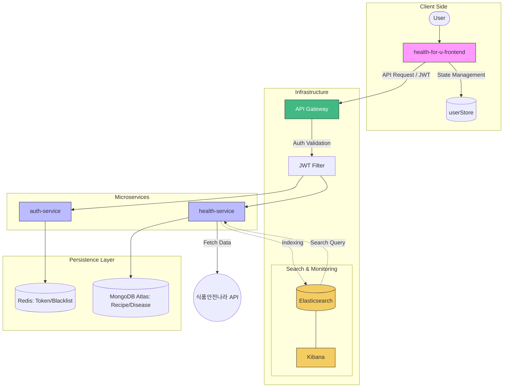

# Healthy Food For U (헬스포유)
> 🥗 서비스 주소 : https://healthforu.co.kr 
> 사용자의 질환 정보를 바탕으로 안전한 맞춤형 레시피를 제안하는 MSA 기반 헬스케어 서비스입니다.

## System Architecture

## Total Tech Stack
- **Language:** Java 21
- **Framework:** Spring Boot, Spring Cloud Gateway
- **Frontend:** Vue 3, Vite, Pinia, Axios
- **Database & Search:** MongoDB Atlas, Redis, Elasticsearch, Kibana
- **Security:** JWT, Spring Security
- **DevOps:** Maven, Spring Cloud Config

---

## Key Features
- **MSA 기반 설계:** 서비스 독립성 확보를 위한 Auth, Health 서비스 분리 및 API Gateway 구축
- **Elasticsearch 기반 고속 통합 검색:**
  - **가중치 기반 검색 (Boosting):** 레시피명(5.0)과 재료(1.0)에 가중치를 부여하여 검색 정확도 최적화
  - **카테고리별 동적 필터링:** 질병 검색 시 검색 결과가 존재하는 카테고리만 실시간으로 노출하는 고성능 쿼리 구현
- **Kibana 데이터 모니터링:** 검색 트래픽 및 인덱싱 상태를 시각화하여 데이터 정합성 및 서비스 상태 모니터링
- **안전한 인증 체계:** JWT와 Redis Blacklist를 연동한 로그아웃 및 보안 필터 구현
- **지능형 레시피 필터링:** 특정 질환별 주의 식품 키워드를 이용한 실시간 레시피 필터링 로직
- **데이터 최적화:** MongoDB Atlas와 Redis를 활용한 NoSQL 기반의 데이터 처리 성능 향상
- **반응형 웹 인터페이스:** Vite와 Vue 3를 활용한 고성능 프론트엔드 구축 및 Pinia 기반의 효율적인 유저 상태 관리

---

## Contributors
- **[김경영](https://github.com/rudduddl)**: 전체 시스템 설계, API Gateway 구축, Auth/Health Service 개발 및 Elasticsearch 통합 검색 엔진 구축

  
