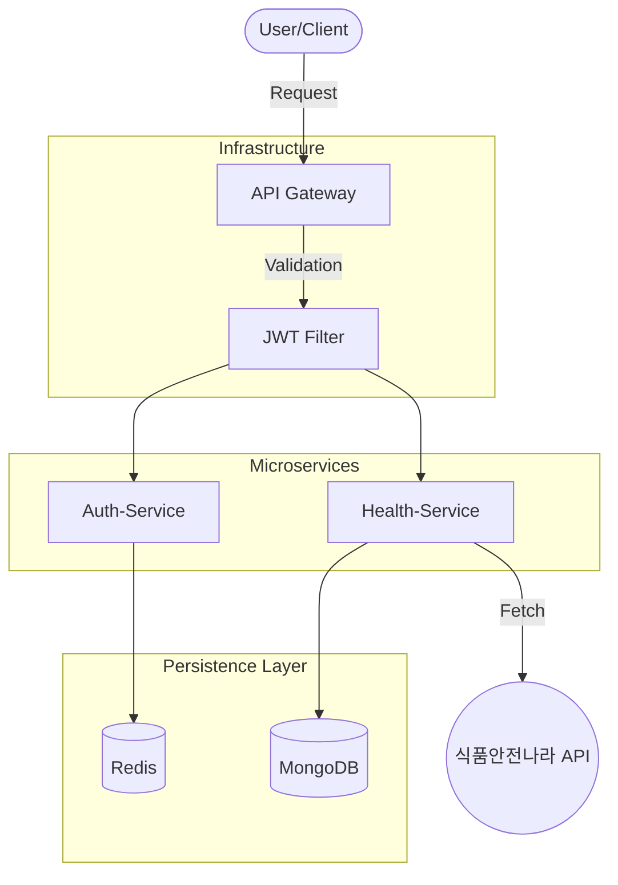

# Healthy Food For U (헬스포유)

> 사용자의 질환 정보를 바탕으로 안전한 맞춤형 레시피를 제안하는 MSA 기반 헬스케어 서비스입니다.

## System Architecture

## Total Tech Stack
- **Language:** Java 21
- **Framework:** Spring Boot, Spring Cloud Gateway
- **Database:** MongoDB Atlas, Redis
- **Security:** JWT, Spring Security
- **DevOps:** Maven, Spring Cloud Config

---

## Key Features
- **MSA 기반 설계:** 서비스 독립성 확보를 위한 Auth, Health 서비스 분리 및 API Gateway 구축
- **안전한 인증 체계:** JWT와 Redis Blacklist를 연동한 로그아웃 및 보안 필터 구현
- **지능형 레시피 필터링:** 특정 질환별 주의 식품 키워드를 이용한 실시간 레시피 필터링 로직
- **데이터 최적화:** MongoDB Atlas와 Redis를 활용한 NoSQL 기반의 데이터 처리 성능 향상

---

## 👥 Contributors
- **[김경영](https://github.com/rudduddl)**: 전체 시스템 설계, API Gateway 구축, Auth/Health Service 개발

  
