# Healthy Food For U (헬스포유)

> 사용자의 질환 정보를 바탕으로 안전한 맞춤형 레시피를 제안하는 MSA 기반 헬스케어 서비스입니다.

## System Architecture

```mermaid
graph TD
    subgraph "Client Side"
        User([User]) --> FE[health-for-u-frontend]
        FE -->|State Management| Pinia[(userStore)]
    end

    FE -->|API Request / JWT| GW[API Gateway]
    
    subgraph "Infrastructure"
        GW -->|Auth Validation| JWT[JWT Filter]
    end

    subgraph "Microservices"
        JWT --> Auth[auth-service]
        JWT --> Health[health-service]
    end

    subgraph "Persistence Layer"
        Auth --> Redis[(Redis: Token/Blacklist)]
        Health --> MongoDB[(MongoDB Atlas: Recipe/Disease)]
    end

    Health -->|Fetch Data| OpenAPI((식품안전나라 API))

    %% 스타일 정의
    style GW fill:#42b883,stroke:#333,color:#fff
    style FE fill:#f9f,stroke:#333
    style Auth fill:#bbf,stroke:#333
    style Health fill:#bbf,stroke:#333

```

## Total Tech Stack
- **Language:** Java 21
- **Framework:** Spring Boot, Spring Cloud Gateway
- **Frontend:** Vue 3, Vite, Pinia, Axios
- **Database:** MongoDB Atlas, Redis
- **Security:** JWT, Spring Security
- **DevOps:** Maven, Spring Cloud Config

---

## Key Features
- **MSA 기반 설계:** 서비스 독립성 확보를 위한 Auth, Health 서비스 분리 및 API Gateway 구축
- **안전한 인증 체계:** JWT와 Redis Blacklist를 연동한 로그아웃 및 보안 필터 구현
- **지능형 레시피 필터링:** 특정 질환별 주의 식품 키워드를 이용한 실시간 레시피 필터링 로직
- **데이터 최적화:** MongoDB Atlas와 Redis를 활용한 NoSQL 기반의 데이터 처리 성능 향상
- **반응형 웹 인터페이스:** Vite와 Vue 3를 활용한 고성능 프론트엔드 구축 및 Pinia 기반의 효율적인 유저 상태 관리

---

## 👥 Contributors
- **[김경영](https://github.com/rudduddl)**: 전체 시스템 설계, API Gateway 구축, Auth/Health Service 개발

  
